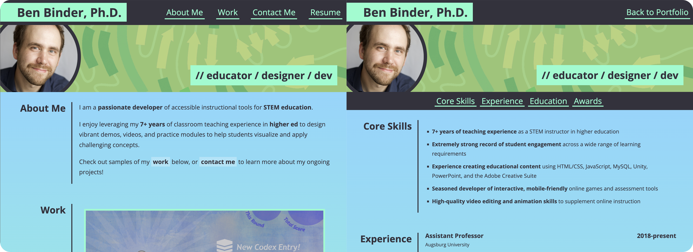

# Dev Portfolio Page

## Description

A mobile-friendly website showcasing the talents and qualifications of the developer. The website incorporates the following features required by the coding challenge:
- Use of **HTML5 semantic tags** to logically organize the HTML document.
- Appropriate, logical use of `class` and `id` attributes.
- Use of accessibility features such as the `alt` attribute for images.
- Incorporation of **comments** into the HTML and CSS files to aid in developer readability.
- Responsive layout for desktop, tablet, and mobile devices, enabled by the use of `@media` queries.
- Layout that mimics the mockup provided with the challenge.

Extra features included for completeness and UX considerations include:
- An additional page (and accompanying stylesheet) housing the developer's current resume.
   
   
   

   

## Usage

The website provides a thorough snapshot of the developer's current skills and portfolio, and should adapt responsively to various different screen sizes. The page can be viewed [here](https://binderb.github.io/dev-portfolio/) on GitHub Pages.

## Credits

Design mockup provided by the UofM Coding Bootcamp (Trilogy Education Services); all code was written by the developer.

## License

Please refer to the LICENSE in the repo.
